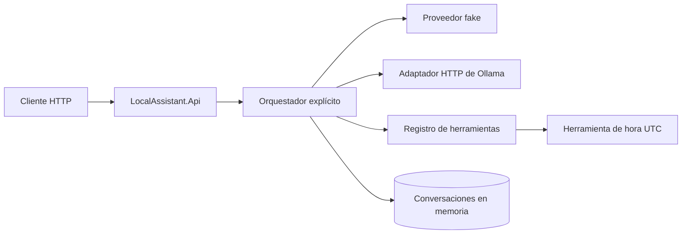
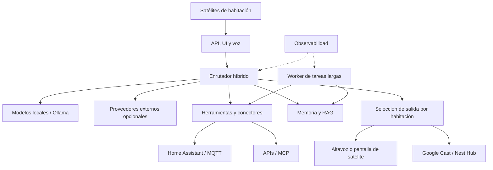

# LocalAssistant

LocalAssistant es un proyecto personal y educativo para comprender cómo se construye un
asistente de IA local: conversación, proveedores de lenguaje, herramientas,
seguridad, memoria, conectores y observabilidad.

La primera iteración es deliberadamente pequeña. Una API recibe un mensaje, un
proveedor seleccionable decide si responde directamente o solicita una herramienta,
el orquestador ejecuta el ciclo de tool calling y la API devuelve la respuesta con
una traza básica. El fake permite reproducir el protocolo y el adaptador de Ollama
permite conectarlo a un modelo local.

El flujo fake y todos los tests funcionan sin GPU, Docker, Ollama, acceso a Internet
ni claves de API.

## Estado actual

Implementado:

- API HTTP en .NET 8.
- Contratos de conversación independientes del proveedor.
- Proveedor fake programado mediante secuencias explícitas.
- Adaptador HTTP de Ollama, configurable y desacoplado del dominio.
- Registro cerrado de herramientas.
- Herramienta determinista de fecha y hora UTC basada en `TimeProvider`.
- Bucle explícito de tool calling con cancelación, timeouts y límite de iteraciones.
- Metadatos de impacto y confirmación de herramientas.
- Conversaciones en memoria.
- Logging estructurado sin contenido de conversación.
- Pruebas unitarias y de integración HTTP.

No implementado: detección automática de capacidades por modelo, proveedores cloud,
persistencia, voz, wake word, RAG, Home Assistant, MQTT, MCP, autenticación,
interfaz gráfica ni ejecución de comandos.

## Arquitectura actual



`LocalAssistant.Api` compone y expone la aplicación. `LocalAssistant.Core` contiene
el dominio y el ciclo de ejecución. `LocalAssistant.Infrastructure` contiene el
adaptador de Ollama. `LocalAssistant.Tests` prueba el conjunto sin servicios externos.

## Requisitos

- SDK de .NET 8. El proyecto se creó con `8.0.202` y permite revisiones posteriores
  de .NET 8 mediante `global.json`.
- Opcional para usar un modelo real: Ollama en `http://localhost:11434` y un modelo
  instalado que admita el comportamiento que se quiera probar.

Conviene utilizar la revisión de seguridad más reciente del SDK 8.x.

## Compilar y probar

Desde la raíz del repositorio:

```powershell
dotnet restore LocalAssistant.sln
dotnet build LocalAssistant.sln --configuration Release --no-restore
dotnet test LocalAssistant.sln --configuration Release --no-build
```

Los tests no usan el reloj real, red, Docker, Ollama ni ningún proveedor externo.

## Ejecutar la API

```powershell
dotnet run --project src/LocalAssistant.Api -- --urls http://localhost:5100
```

La comprobación de salud queda disponible en `http://localhost:5100/health`.

### Escenario 1: respuesta directa

En otra terminal de PowerShell:

```powershell
$body = @{ message = "Hola"; scenario = "direct" } | ConvertTo-Json
Invoke-RestMethod -Method Post `
  -Uri http://localhost:5100/api/conversations/messages `
  -ContentType application/json `
  -Body $body
```

El fake responderá `Fake response: Hola` en una iteración y sin herramientas.

### Escenario 2: herramienta de fecha y hora

```powershell
$body = @{ message = "¿Qué hora es?"; scenario = "time" } | ConvertTo-Json
Invoke-RestMethod -Method Post `
  -Uri http://localhost:5100/api/conversations/messages `
  -ContentType application/json `
  -Body $body
```

El fake solicitará `get_current_time`, recibirá su JSON y generará la respuesta
final en una segunda iteración. La respuesta incluye `conversationId`, `tools`,
`iterations`, `timings` y `error`.

El campo `scenario` solo existe para demostrar de forma reproducible el proveedor
fake. El campo `provider` selecciona `fake` (valor predeterminado) u `ollama`.

### Probar con Ollama

Configura el nombre exacto de un modelo ya instalado y arranca la API:

```powershell
$env:LocalAssistant__Ollama__Model = "nombre-del-modelo"
dotnet run --project src/LocalAssistant.Api -- --urls http://localhost:5100
```

En otra terminal:

```powershell
$body = @{ message = "Hola"; provider = "ollama" } | ConvertTo-Json
Invoke-RestMethod -Method Post `
  -Uri http://localhost:5100/api/conversations/messages `
  -ContentType application/json `
  -Body $body
```

El endpoint se configura mediante `LocalAssistant:Ollama:Endpoint` (por defecto,
`http://localhost:11434`) y `LocalAssistant:Ollama:Model`. El adaptador usa
`POST /api/chat` sin streaming. Todavía falta validar el recorrido completo contra
una instalación real y documentar qué modelos ofrecen tool calling fiable.

## Límites importantes

- Las conversaciones se pierden al reiniciar y no soportan coordinación entre
  varias instancias de la API.
- La aprobación de herramientas es un punto de extensión técnico, no identidad ni
  autorización completa.
- Los timeouts detienen la espera cooperativa; una implementación de herramienta
  que ignore el token podría seguir trabajando internamente.
- El fake demuestra el protocolo, no inteligencia ni comprensión del lenguaje.
- La compatibilidad de tool calling depende del modelo de Ollama seleccionado; esta
  versión aún no detecta sus capacidades ni limita el contexto de forma explícita.
- No existe todavía un `LocalAssistant.Worker`: se añadirá cuando haya una tarea de fondo
  concreta que lo justifique.
- El proyecto se distribuye bajo la licencia MIT.

Consulta [la arquitectura](docs/ARCHITECTURE.md), [la visión](docs/VISION.md),
[la seguridad](docs/SECURITY.md), [el roadmap](docs/ROADMAP.md),
[OpenAPI](docs/api/openapi.yaml) y [los estándares](docs/standards/README.md) para
continuar.

## Evolución prevista, no implementada



Las cajas de este segundo diagrama son objetivos de evolución; no describen
componentes disponibles en la versión actual.
