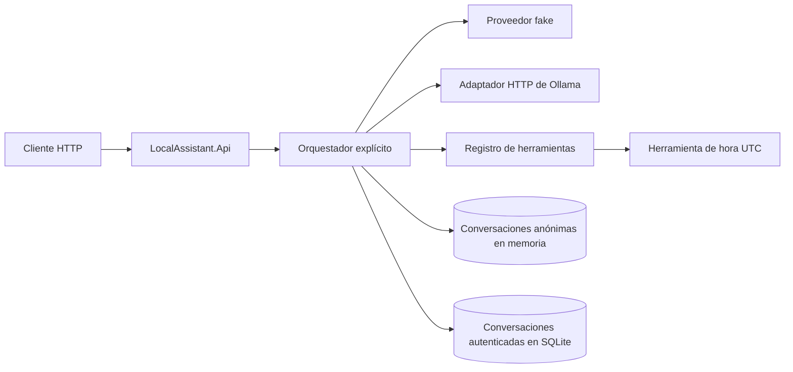
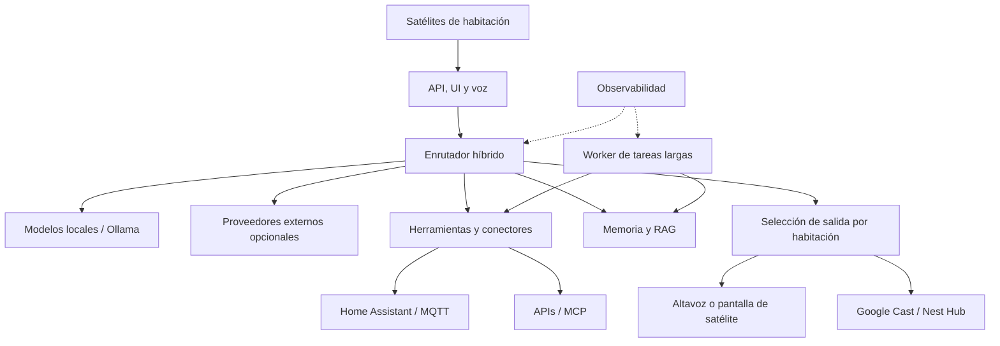

# LocalAssistant

[](https://github.com/carlos-aisa/LocalAssistant/actions/workflows/ci.yml)
[](https://github.com/carlos-aisa/LocalAssistant/actions/workflows/ci.yml)
[](https://dotnet.microsoft.com/)
[](https://learn.microsoft.com/aspnet/core/)
[](https://ollama.com/)
[](docs/api/openapi.yaml)
[](LICENSE)

LocalAssistant es un proyecto personal y educativo para comprender cómo se construye un
asistente de IA local: conversación, proveedores de lenguaje, herramientas,
seguridad, memoria, conectores y observabilidad.

La primera iteración es deliberadamente pequeña. Una API recibe un mensaje, un
proveedor seleccionable decide si responde directamente o solicita una herramienta,
el orquestador ejecuta el ciclo de tool calling y la API devuelve la respuesta con
una traza básica. El fake permite reproducir el protocolo y el adaptador de Ollama
permite conectarlo a un modelo local.

El flujo fake y todos los tests funcionan sin GPU, Docker, Ollama, acceso a Internet
ni claves de API.

## Estado actual

Implementado:

- API HTTP en .NET 8.
- Contratos de conversación independientes del proveedor.
- Proveedor fake programado mediante secuencias explícitas.
- Adaptador HTTP de Ollama, configurable y desacoplado del dominio.
- Registro cerrado de herramientas.
- Herramienta determinista de fecha y hora UTC basada en `TimeProvider`.
- Bucle explícito de tool calling con cancelación, timeouts y límite de iteraciones.
- Metadatos de impacto y confirmación de herramientas.
- Perfiles multidimensionales de riesgo y filtrado de herramientas no autorizadas.
- Conversaciones autenticadas vinculadas al principal que las creó; las anónimas son
  públicas y efímeras.
- Auditoría local en memoria de decisiones y ejecuciones de herramientas, sin
  argumentos ni resultados.
- Errores de herramienta separados entre el detalle para el proveedor y el mensaje
  seguro expuesto por la API.
- Bootstrap local de instalación con un único propietario y API key generada una sola
  vez; se conserva únicamente su hash.
- Identidad local opcional mediante API key y scopes concedidos por el servidor para
  pruebas o configuración educativa.
- Política de egreso denegada por defecto y pasarela de adaptadores externos sin
  proveedores reales habilitados.
- Conversaciones autenticadas persistibles en SQLite de forma opcional; las anónimas
  siguen en memoria y son efímeras.
- Retención configurable de conversaciones persistidas, inicialmente 30 días, y
  borrado selectivo interno protegido por propietario.
- Logging estructurado sin contenido de conversación.
- Pruebas unitarias y de integración HTTP.
- Contratos de proveedor reutilizados por el fake y el adaptador de Ollama.
- Evaluación local reproducible de decisiones de tool calling por modelo.

No implementado: detección automática de capacidades por modelo, acceso real a
Internet, proveedores cloud, retención y auditoría durable, gestión de usuarios, voz, wake word,
RAG, Home Assistant, MQTT, MCP, interfaz gráfica ni ejecución de comandos.

## Arquitectura actual



`LocalAssistant.Api` compone y expone la aplicación. `LocalAssistant.Core` contiene
el dominio y el ciclo de ejecución. `LocalAssistant.Infrastructure` contiene el
adaptador de Ollama. `LocalAssistant.Tests` prueba el conjunto sin servicios externos.

## Requisitos

- SDK de .NET 8. El proyecto se creó con `8.0.202` y permite revisiones posteriores
  de .NET 8 mediante `global.json`.
- Opcional para usar un modelo real: Ollama en `http://localhost:11434` y un modelo
  instalado que admita el comportamiento que se quiera probar.

Conviene utilizar la revisión de seguridad más reciente del SDK 8.x.

## Compilar y probar

Desde la raíz del repositorio:

```powershell
dotnet restore LocalAssistant.sln
dotnet build LocalAssistant.sln --configuration Release --no-restore
dotnet test LocalAssistant.sln --configuration Release --no-build
```

Los tests no usan el reloj real, red, Docker, Ollama ni ningún proveedor externo.
CI publica un informe de cobertura como artefacto y mantiene el badge de la portada
actualizado desde `main`. La cobertura es informativa; todavía no existe un umbral.

## Ejecutar la API

```powershell
dotnet run --project src/LocalAssistant.Api -- --urls http://localhost:5100
```

La comprobación de salud queda disponible en `http://localhost:5100/health`.

### Persistencia de conversaciones

La persistencia está desactivada por defecto. Para conservar solo conversaciones
autenticadas en SQLite, configura una ruta absoluta y la retención en días antes de
arrancar la API:

```powershell
$env:LocalAssistant__ConversationPersistence__Enabled = "true"
$env:LocalAssistant__ConversationPersistence__DatabasePath = "C:\LocalAssistant\conversations.db"
$env:LocalAssistant__ConversationPersistence__RetentionDays = "30"
```

Las conversaciones anónimas no se escriben en SQLite. El archivo y sus copias de
seguridad contienen datos privados y deben protegerse mediante permisos y controles
del sistema operativo.

### Raíz documental local

La primera fuente documental permitida es la carpeta Documentos resuelta por el
sistema operativo. No se explora ni se lee durante el arranque, y todavía no está
expuesta mediante una herramienta, endpoint o búsqueda.

Para usar una carpeta distinta, configura una ruta absoluta existente antes de
arrancar la API:

```powershell
$env:LocalAssistant__DocumentSources__DocumentsRoot = "C:\LocalAssistant\Documents"
```

No se aceptan rutas relativas. Configurar esta raíz no concede acceso a discos,
`AppData`, repositorios ni otras carpetas; una capacidad futura deberá usarla de
forma explícita.

### Bootstrap de instalación y identidad local

Para inicializar una instalación local con un único propietario, ejecuta este comando
en la consola del equipo que la administra. No abre el servidor HTTP:

```powershell
dotnet run --project src/LocalAssistant.Api -- --bootstrap-owner
```

Guarda la API key que muestra una única vez. El estado mínimo de instalación se guarda
por defecto en `%LOCALAPPDATA%\LocalAssistant\installation-identity.json`; contiene
solo el hash SHA-256 de la clave. Una segunda ejecución se rechaza. Después inicia la
API normalmente y envía la clave con `X-LocalAssistant-Api-Key`.

La variable `LocalAssistant__Installation__StateDirectory` permite elegir una ruta
absoluta distinta para ese estado. No combines este bootstrap con la configuración
`LocalAssistant__Identity__Enabled=true`.

La API también funciona de forma anónima para herramientas públicas. Para pruebas o
para configurar de forma educativa un principal local con scopes concedidos por el
servidor, usa el mecanismo siguiente.

Configura un hash SHA-256 de una API key fuera de los archivos versionados. Este
ejemplo genera una clave efímera para la sesión actual de PowerShell:

```powershell
$apiKey = [Guid]::NewGuid().ToString("N")
$apiKeyHash = [Convert]::ToHexString(
  [Security.Cryptography.SHA256]::HashData([Text.Encoding]::UTF8.GetBytes($apiKey)))
$env:LocalAssistant__Identity__Enabled = "true"
$env:LocalAssistant__Identity__PrincipalId = "local-owner"
$env:LocalAssistant__Identity__ApiKeySha256 = $apiKeyHash
$env:LocalAssistant__Identity__Scopes__0 = "example.read"
dotnet run --project src/LocalAssistant.Api -- --urls http://localhost:5100
```

Envía la clave mediante el header `X-LocalAssistant-Api-Key`; nunca la incluyas en
el cuerpo de la petición ni la guardes en `appsettings.json`:

```powershell
$headers = @{ "X-LocalAssistant-Api-Key" = $apiKey }
Invoke-RestMethod -Method Post `
  -Uri http://localhost:5100/api/conversations/messages `
  -Headers $headers `
  -ContentType application/json `
  -Body (@{ message = "Hola"; scenario = "direct" } | ConvertTo-Json)
```

Una clave presentada pero inválida devuelve `401`. La ausencia de clave mantiene el
contexto anónimo; una herramienta que exija autenticación o un scope no se expondrá
al proveedor y se denegará antes de ejecutarse. Esta implementación admite un único
principal configurado y no sustituye gestión de usuarios, HTTPS ni propiedad de
conversaciones.

### Escenario 1: respuesta directa

En otra terminal de PowerShell:

```powershell
$body = @{ message = "Hola"; scenario = "direct" } | ConvertTo-Json
Invoke-RestMethod -Method Post `
  -Uri http://localhost:5100/api/conversations/messages `
  -ContentType application/json `
  -Body $body
```

El fake responderá `Fake response: Hola` en una iteración y sin herramientas.

### Escenario 2: herramienta de fecha y hora

```powershell
$body = @{ message = "¿Qué hora es?"; scenario = "time" } | ConvertTo-Json
Invoke-RestMethod -Method Post `
  -Uri http://localhost:5100/api/conversations/messages `
  -ContentType application/json `
  -Body $body
```

El fake solicitará `get_current_time`, recibirá su JSON y generará la respuesta
final en una segunda iteración. La respuesta incluye `conversationId`, `tools`,
`iterations`, `timings` y `error`.

### Escenario 3: conversión de temperatura

```powershell
$body = @{ message = "Convierte 100 grados Celsius a Fahrenheit"; scenario = "temperature" } |
  ConvertTo-Json
Invoke-RestMethod -Method Post `
  -Uri http://localhost:5100/api/conversations/messages `
  -ContentType application/json `
  -Body $body
```

El fake solicitará `convert_temperature` con valor, unidad de origen y unidad de
destino. La herramienta solo admite Celsius, Fahrenheit y Kelvin y rechaza
argumentos no esperados o temperaturas inferiores al cero absoluto.

El campo `scenario` solo existe para demostrar de forma reproducible el proveedor
fake. El campo `provider` selecciona `fake` (valor predeterminado) u `ollama`.

### Probar con Ollama

Configura el nombre exacto de un modelo ya instalado y arranca la API. En un equipo
con unos 8 GB de RAM, `qwen3:1.7b` es un punto de partida comprobado:

```powershell
$env:LocalAssistant__Ollama__Model = "qwen3:1.7b"
dotnet run --project src/LocalAssistant.Api -- --urls http://localhost:5100
```

En otra terminal:

```powershell
$body = @{ message = "Hola"; provider = "ollama" } | ConvertTo-Json
Invoke-RestMethod -Method Post `
  -Uri http://localhost:5100/api/conversations/messages `
  -ContentType application/json `
  -Body $body
```

El endpoint se configura mediante `LocalAssistant:Ollama:Endpoint` (por defecto,
`http://localhost:11434`) y `LocalAssistant:Ollama:Model`. La opción
`LocalAssistant:Ollama:Think` vale `false` por defecto para priorizar latencia y
respuestas finales; puede activarse para modelos y casos que necesiten razonamiento
explícito. El adaptador usa `POST /api/chat` sin streaming. El timeout de proveedor
predeterminado es de tres minutos para admitir inferencia local en CPU.
`LocalAssistant:Ollama:ContextWindow` vale `4096` y se envía como `options.num_ctx`.

Antes de la primera conversación con una combinación de endpoint y modelo, la API
consulta `POST /api/show`. Rechaza con `400` una configuración cuyo modelo no esté
instalado, no declare la capacidad `tools` o no pueda validarse. Las validaciones
correctas se cachean durante la vida del proceso; los fallos se reintentan en la
siguiente petición para permitir instalar o corregir el modelo sin reiniciar la API.
Si `/api/show` publica un valor `*.context_length`, la configuración tampoco puede
superarlo.

### Validación local observada

El 17 de agosto de 2026 se completó un smoke test real con Ollama `0.32.14`,
`qwen3:1.7b`, `Think: false`, CPU y aproximadamente 8 GB de RAM. No se añadieron
instrucciones de control al mensaje del usuario:

- primera respuesta tras cargar el modelo, en una iteración: 13,4 segundos;
- llamada a `get_current_time` con el modelo caliente y respuesta final en dos
  iteraciones: 6,4 segundos;
- herramienta ejecutada correctamente y sin errores de orquestación.

Las cifras son una observación de ese equipo, no un objetivo de rendimiento. En el
mismo entorno, `qwen3:4b` superó los dos minutos para una respuesta pequeña y no
resultó práctico para el bucle interactivo.

El 18 de agosto de 2026 se ejecutó además la evaluación reproducible de decisiones
de herramienta: `qwen3:1.7b` superó 15 de 15 casos, incluidos seis en los que no
debía invocar la herramienta. La media fue 11,9 segundos por turno y la mediana
9,7 segundos. Consulta la [metodología, ejecución y límites](docs/evaluations/TOOL_CALLING.md).

## Límites importantes

- Las conversaciones anónimas se pierden al reiniciar. Los turnos de una misma
  conversación se serializan dentro de un proceso de API, pero no existe
  coordinación entre varias instancias ni se conservan las confirmaciones pendientes.
- Las confirmaciones de herramientas retienen en el servidor la llamada exacta,
  caducan y se consumen una vez. Cuando la llamada procede de un principal
  autenticado, solo ese principal puede resolverla; aún no hay gestión de usuarios.
  Las conversaciones autenticadas persistidas conservan su propiedad; las
  conversaciones anónimas no son privadas.
- La auditoría actual se pierde al reiniciar y no es un registro durable ni
  consultable. La confirmación de un único uso no sustituye una clave de idempotencia
  para futuras herramientas con cambios de estado o coste.
- Los timeouts detienen la espera cooperativa; una implementación de herramienta
  que ignore el token podría seguir trabajando internamente.
- El fake demuestra el protocolo, no inteligencia ni comprensión del lenguaje.
- La compatibilidad de tool calling depende del modelo de Ollama seleccionado. La
  evaluación actual cubre una sola herramienta y una muestra pequeña; no garantiza
  la calidad general del modelo.
- `Think: false` solicita desactivar el razonamiento, pero el comportamiento final
  depende del modelo y de su plantilla.
- `ContextWindow` acota la ventana usada por Ollama, pero LocalAssistant todavía no
  cuenta tokens ni resume o trunca el historial antes de enviarlo.
- No existe todavía un `LocalAssistant.Worker`: se añadirá cuando haya una tarea de fondo
  concreta que lo justifique.
- El proyecto se distribuye bajo la licencia MIT.

Consulta [la arquitectura](docs/ARCHITECTURE.md), [la visión](docs/VISION.md),
[la seguridad](docs/SECURITY.md), [el roadmap](docs/ROADMAP.md),
[OpenAPI](docs/api/openapi.yaml) y [los estándares](docs/standards/README.md) para
continuar.

## Evolución prevista, no implementada



Las cajas de este segundo diagrama son objetivos de evolución; no describen
componentes disponibles en la versión actual.
