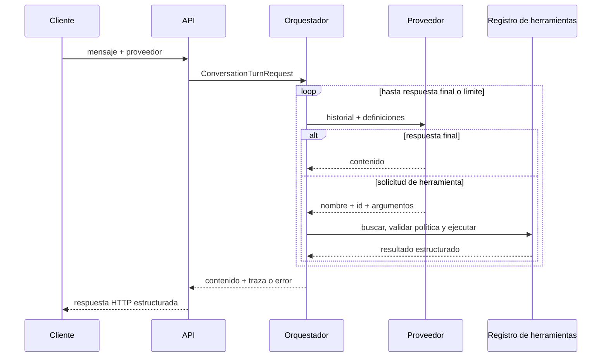
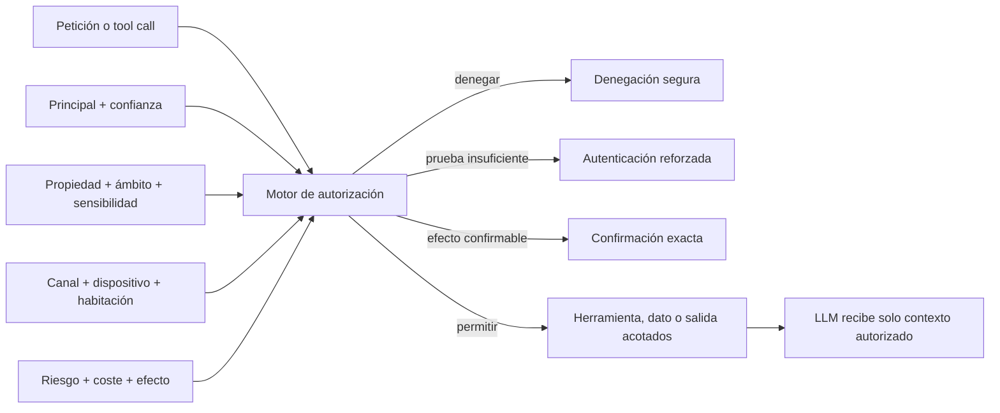
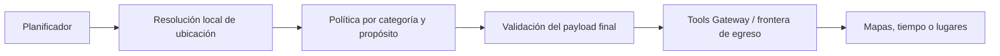
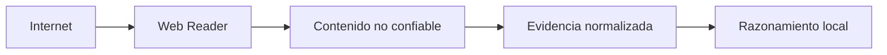
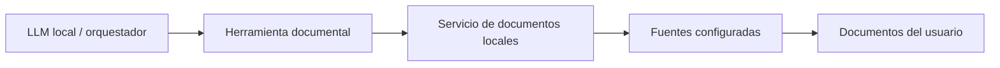

# Arquitectura

## Alcance implementado

La primera versión es un núcleo modular desplegado junto a una API. Solo se separan
ensamblados con responsabilidades ejecutables y comprobables:

- `LocalAssistant.Core`: contratos de conversación, proveedores, herramientas,
  almacenamiento en memoria y orquestación.
- `LocalAssistant.Api`: composición, configuración, escenarios demostrativos y endpoint.
- `LocalAssistant.Infrastructure`: adaptadores de sistemas externos; actualmente,
  el cliente HTTP de Ollama.
- `LocalAssistant.Tests`: pruebas unitarias e integración HTTP en proceso.

No hay worker ni microservicios. Ollama sigue siendo un proceso externo opcional;
voz, Home Assistant, MQTT, bases vectoriales y Open WebUI son evoluciones futuras.

## Flujo de una conversación



El modelo nunca ejecuta código. Devuelve una solicitud estructurada y el
orquestador solo puede resolverla contra `IToolRegistry`.

## Contratos principales

- `ILanguageProvider` recibe mensajes y definiciones de herramientas.
- `ITool` declara metadatos, esquema de entrada y ejecución cancelable.
- `IToolRegistry` constituye la allowlist de capacidades disponibles.
- `IConversationStore` aísla el orquestador del almacenamiento actual.
- `IConversationOrchestrator` ejecuta el protocolo y produce la traza.

Cada herramienta declara un perfil de riesgo con impacto, sensibilidad, exposición,
coste, confirmación explícita y scopes necesarios. Una lectura puede exponer
presencia, calendario, correo, ubicación, cámaras, memoria o documentos y no se
considera segura solo por no modificar estado. El orquestador filtra el catálogo que
recibe el proveedor y vuelve a evaluar antes de ejecutar. El contexto procede del
límite HTTP: sin API key es anónimo; con una API key válida, el adaptador crea un
principal y scopes definidos exclusivamente por el servidor. La identidad puede
proceder del bootstrap local de la instalación o de la configuración educativa
existente, pero nunca de ambas fuentes a la vez. Una herramienta privada, sensible,
con scope ausente o externa queda denegada. La API key es opcional para las
herramientas públicas y no constituye un modelo completo de autorización.

La confirmación pendiente conserva también el principal que originó la llamada. La
resolución debe provenir del mismo principal antes de consumirla; una discrepancia se
presenta como no encontrada. Las conversaciones creadas por un principal autenticado
conservan ese propietario en memoria y solo él puede continuarlas o resolver sus
confirmaciones. Las conversaciones anónimas permanecen sin propietario, públicas y
efímeras; no se convertirán automáticamente en conversaciones privadas persistentes.

La primera operación local que cambia estado es `create_reminder`. Requiere el scope
`reminders.write` y una confirmación retenida por el servidor. Al crear esa
confirmación, el orquestador asigna un identificador de operación interno y lo entrega
a la herramienta únicamente después de aprobarla. El almacén de recordatorios en
memoria obtiene o crea el resultado por principal e identificador de operación, de
forma que una repetición no produzca un segundo recordatorio. Esta garantía no
sobrevive a reinicios, no cubre varios procesos y no convierte el componente en una
agenda ni en un planificador de avisos.

El fake usa una cola de funciones de respuesta. Cada llamada consume exactamente
un paso, por lo que una prueba declara de forma visible la secuencia esperada.

Una suite abstracta de contratos se ejecuta contra `ScriptedLanguageProvider` y
`OllamaLanguageProvider`. Verifica que cada implementación expone un nombre estable,
distingue respuesta final de solicitud de herramienta, conserva nombre y argumentos
estructurados y respeta una cancelación previa. Las pruebas específicas de cada
adaptador siguen cubriendo serialización y errores propios; la suite común no intenta
ocultar esas diferencias.

## Dirección futura: identidad y autorización domésticas

El bootstrap implementado identifica una instalación y crea un único propietario
local, con una API key cuyo hash permanece en el estado de instalación. La API key
configurada sigue disponible como frontera educativa. Ninguna de las dos opciones
modela todavía un hogar, usuarios, invitados, propiedad persistente ni niveles de
confianza. La evolución sustituirá estos adaptadores en el límite de entrada sin
trasladar SDKs de identidad al núcleo ni permitir que el cliente o el LLM creen
permisos.

La persistencia local de conversaciones autenticadas se implementa con SQLite, elegida para el
patrón actual de recuperación por conversación, propiedad y anexado ordenado de
mensajes. El adaptador permanecerá fuera del núcleo y las conversaciones anónimas no
se convertirán por ello en datos privados persistentes. La decisión y sus límites de
protección en reposo se recogen en el [ADR 0024](adr/0024-use-sqlite-for-local-conversation-persistence.md).
El ciclo de vida, retención y borrado selectivo de estos datos se definen en el
[ADR 0025](adr/0025-define-private-storage-lifecycle.md).

Las decisiones se recogen en [ADR 0017](adr/0017-combine-roles-capabilities-context-and-risk-for-authorization.md),
[ADR 0018](adr/0018-treat-voice-as-context-not-strong-authentication.md),
[ADR 0019](adr/0019-authorize-memory-before-retrieval.md) y
[ADR 0020](adr/0020-isolate-guests-in-expiring-sessions.md).

El modelo conceptual separará, al menos, estas responsabilidades:

| Concepto | Responsabilidad |
| --- | --- |
| Instalación u hogar | Límite inicial de administración, datos compartidos y dispositivos registrados. |
| Principal humano | Propietario de datos y sujeto al que se conceden capacidades. |
| Principal técnico | Satélite, worker, conector o servicio con credenciales revocables y privilegios mínimos. |
| Asignación de rol | Conjunto provisional de capacidades iniciales; no decisión final. |
| Concesión de capacidad | Permiso específico para leer, modificar, aprobar o ejecutar dentro de un ámbito. |
| Política de recurso | Propiedad, ámbito personal o compartido, sensibilidad y reglas del módulo. |
| Contexto de autenticación | Método, confianza, dispositivo, canal, habitación y caducidad de la prueba. |
| Sesión de invitado | Autorización temporal, aislada, revocable y con presupuesto propio. |

Los roles iniciales serán `Owner/Administrator`, `Adult Household Member`, `Child
Household Member` y `Guest`. Existirán además identidades de dispositivo o servicio,
que no heredarán roles humanos. El propietario podrá administrar la instalación, pero
seguirá sujeto a confirmaciones destructivas, protección de secretos, privacidad del
canal de salida, auditoría y separación de transiciones. Un adulto podrá invitar solo
con una capacidad explícita; un menor no podrá gestionar invitados; el invitado será
denegado por defecto salvo capacidades acotadas de su sesión.

Los nombres de capacidades se definirán con cada vertical slice. El vocabulario
conceptual distinguirá operaciones como `memory.personal.read`,
`memory.household.write`, `batchcooking.preference.rate`,
`home.safe_actions.execute`, `extensions.approve`, `users.invite_guest`,
`audit.read` o `system.configure`. Son ejemplos, no un catálogo estable. Los módulos
declararán qué capacidades consumen o exponen, pero no podrán concederlas ni modificar
la política.



La decisión será determinista y externa al modelo. Evaluará rol, concesiones y
denegaciones específicas, propiedad, contexto, riesgo y confianza; podrá permitir,
denegar, exigir `step-up`, exigir confirmación o restringir la salida. El modelo solo
podrá solicitar la capacidad visible. Una aprobación no elevará otros permisos ni
autorizará una operación distinta.

La memoria se dividirá en conocimiento general, memoria personal, memoria compartida
del hogar, estado de módulo, memoria administrativa y sesión efímera. Cada elemento
persistido tendrá propietario, ámbito, autorización, fuente, sensibilidad, fechas,
retención y borrado. Búsqueda, ranking y recuperación aplicarán el filtro antes de
entregar fragmentos al modelo; ocultar después la respuesta sería demasiado tarde.

Una invitación futura almacenará quién invita, caducidad, habitaciones o dispositivos,
capacidades, proveedor permitido, cuota o presupuesto, persistencia y revocación. Una
sesión de voz invitada afectará solo a la habitación y duración aprobadas, no a todo el
hogar. La voz y el reconocimiento de hablante aportarán señales `Confirmed`,
`Probable`, `Unknown`, `Guest` o `Insufficient`; las acciones sensibles requerirán una
prueba adicional desde un canal autenticado.

El bootstrap inicial creará exactamente un propietario durante una ventana de
configuración local y se invalidará al terminar. No usará credenciales publicadas ni
permitirá que el primer cliente de la red reclame la instalación. Recuperación,
revocación y reemplazo del administrador serán flujos explícitos y auditables cuyo
mecanismo se elegirá cuando exista una superficie de administración real.

## Adaptador de Ollama

`OllamaLanguageProvider` implementa `ILanguageProvider` mediante la API HTTP nativa
de Ollama, sin introducir sus DTOs en `LocalAssistant.Core`. Traduce el historial,
los esquemas de herramientas, las solicitudes de función y sus resultados. Para
mantener un primer vertical slice pequeño y predecible, solicita `stream: false`.
El modo de razonamiento se transmite mediante `think` y queda desactivado por
defecto para reducir latencia; no se altera el texto del usuario para controlarlo.
La ventana se transmite como `options.num_ctx`, con 4096 tokens por defecto.

La API selecciona `fake` u `ollama` por turno. Ollama requiere un modelo configurado;
si falta, la petición se rechaza como error de validación antes de entrar en el
orquestador. Los tests del adaptador sustituyen la red por un manejador HTTP
determinista. Un smoke test real con `qwen3:1.7b` verificó tanto respuesta directa
como tool calling; sus tiempos dependen del modelo y del hardware.

Antes de seleccionar Ollama, `OllamaModelInspector` consulta `POST /api/show` y
requiere la capacidad `tools`. Una caché compartida por proceso evita repetir el
preflight para una combinación de endpoint y modelo ya validada. Solo se cachean
éxitos: modelo ausente, capacidad insuficiente, endpoint inválido o fallo HTTP se
devuelven como errores claros de configuración y pueden corregirse sin reiniciar.
La inspección ocurre antes de crear el turno, por lo que esos fallos no modifican el
historial de conversación. Cuando los metadatos contienen `*.context_length`, el
inspector rechaza una ventana configurada por encima del máximo del modelo.

## Dirección futura: privacidad y frontera de egreso

El núcleo implementa una política determinista de clasificación y decisión de
egreso, y `LocalAssistant.Infrastructure` aporta una primera pasarela controlada.
No existe todavía un adaptador de producción ni acceso real a red. El modelo local
podrá usar contexto privado para decidir qué hacer, pero ese contexto no se
convertirá implícitamente en una solicitud externa.

La política de privacidad será anterior al routing de proveedor y constituirá una
restricción dura. Capacidad, dificultad, latencia, coste o falta de recursos locales
no permitirán enviar categorías `DENY` a un LLM externo. El router solo comparará
proveedores que puedan recibir el payload ya autorizado. Cuando una petición dependa
de contexto protegido que el modelo local no pueda procesar, podrá continuar con
capacidad reducida, usar únicamente una parte pública o saneada si sigue siendo útil,
o comunicar la limitación; la experiencia concreta queda pospuesta.

La política clasifica descriptores de campos mediante categorías extensibles. Una
categoría nueva o desconocida se deniega por defecto. La referencia implementada es:

| Categoría | Política inicial |
| --- | --- |
| `SOURCE_CODE`, `REPOSITORY_DATA` | `DENY` |
| `LOCAL_FILES`, `LOCAL_DOCUMENTS`, `RAG_CONTENT` | `DENY` |
| `MEMORY`, `CONVERSATIONS`, `DATABASE_DATA` | `DENY` |
| `SECRETS`, `CREDENTIALS`, `ENVIRONMENT`, `PRIVATE_CONFIG` | `DENY` |
| `LOCATION` | `ALLOW_WHEN_REQUIRED` |
| `SEARCH_QUERY` | `ALLOW_SANITIZED` |
| `PUBLIC_DATA` | `ALLOW` |

La lista no es un enum cerrado ni una autorización global. La decisión actual recibe
categoría, propósito y destino, y valida que `LOCATION` sea necesaria y que
`SEARCH_QUERY` esté marcado como saneado. La pasarela resuelve un adaptador desde su
allowlist, comprueba la operación, rechaza nombres de campo duplicados, construye la
decisión sobre los descriptores exactos y solo entonces entrega los valores al
adaptador. Autorizar un campo `LOCATION` no autorizará otros campos del mismo turno.

Los contratos de `LocalAssistant.Core.ExternalTools` no dependen de SDKs. Cada
adaptador fija su nombre, destino y operaciones; el solicitante no aporta una URL
libre. `ControlledExternalToolsGateway` traduce excepciones a errores seguros y sus
logs contienen adaptador, operación y decisión, nunca valores del payload. Los
adaptadores actuales son dobles de prueba: credenciales, HTTP, rate limits, timeout,
respuesta no confiable y auditoría durable se incorporarán con el primer proveedor
real.

La validación se realizará sobre el payload final. Una transformación local no
cambia automáticamente la categoría: nombres de clases, repositorios, hosts, URLs,
resúmenes o consultas derivados de información protegida seguirán protegidos. Así
se evita que un dato denegado salga indirectamente convertido en una búsqueda.

### Resolución local de ubicación

Una abstracción futura `LocationProvider` resolverá referencias antes de llamar a
servicios externos:

- `HomeLocation`: referencia configurada y conservada localmente para «en casa».
- `MobileCurrentLocation`: posición aportada por un cliente identificado cuando el
  usuario haya concedido permiso y la lectura sea suficientemente reciente.
- `ExplicitLocation`: lugar escrito o pronunciado en la petición actual.

La ubicación explícita será suficiente siempre que pueda resolver la operación, sin
consultar hogar, móvil, perfil ni memoria. Para routing, lugares cercanos o tiempo
meteorológico se enviará la precisión mínima aceptada por el servicio: texto,
ubicación aproximada, dirección o coordenadas solo según necesidad.



El ejemplo «¿cuánto se tarda de casa al aeropuerto?» podrá enviar únicamente origen
y destino al proveedor de routing. No enviará historial, memoria, documentos,
familia, perfil, código ni ningún otro contexto usado durante el razonamiento local.

### Cobertura de toda comunicación saliente

La frontera no se limitará a herramientas de Internet. LLM cloud, STT, TTS,
embeddings, telemetría, analítica, crash reporting, actualizaciones y SDKs de
terceros deberán declarar y validar sus payloads con la misma política. Siempre que
sea técnicamente práctico, los componentes internos carecerán de salida directa y
la topología obligará a atravesar un proxy o límite equivalente controlado. El
mecanismo de red concreto queda pospuesto hasta elegir despliegue.

### Frontera de entrada no confiable

El contenido recuperado de Internet será evidencia, no instrucciones. Un lector
web extraerá datos bajo límites de red y tamaño y los entregará a una zona lógica de
contenido no confiable. Esa zona no podrá conceder permisos, solicitar secretos,
leer memoria o archivos, alterar políticas ni activar herramientas por sí misma.



Las pruebas futuras cubrirán tanto la decisión lógica como la imposibilidad técnica
de saltarse estas fronteras. La auditoría conservará destino, categorías, propósito
y resultado, pero no copiará automáticamente el payload ni el contenido recuperado.

## Base actual y dirección futura: búsqueda de documentos locales

`ILocalDocumentRoot` representa la única raíz documental permitida. Por defecto se
resuelve como la carpeta Documentos real del usuario mediante el sistema operativo,
sin fijar un nombre de usuario ni una ruta. La configuración
`LocalAssistant:DocumentSources:DocumentsRoot` puede sustituirla solo por una ruta
absoluta existente. El arranque rechaza una ruta relativa o no disponible y no
explora ni lee la carpeta. Añadir otra carpeta requerirá una capacidad y
configuración explícitas. Discos completos, perfil entero, `AppData`, directorios
del sistema y repositorios no son fuentes implícitas.

El LLM no recibe una herramienta genérica de archivos ni produce comandos. La API
expone `GET /api/documents` para descubrimiento explícito por metadatos, protegido
por el scope `documents.search`, y `GET /api/documents/{id}/content` para lectura
explícita, protegida por `documents.read`. La búsqueda devuelve una referencia opaca
protegida durante quince minutos. `FileSystemDocumentSearch` y
`FileSystemDocumentContentReader` y `FileSystemDocumentContentSearch` resuelven solo
rutas relativas bajo
`ILocalDocumentRoot`, omiten enlaces y revalidan el destino antes de abrirlo.

`GET /api/documents/content-search` es una tercera capacidad, protegida por el scope
independiente `documents.content.search`. Abre únicamente los formatos de texto ya
permitidos, de hasta 1 MiB, para comparar una frase literal sin distinción de
mayúsculas. La respuesta es de metadatos seguros: no devuelve el texto, fragmentos
ni rutas absolutas. Es una exploración directa sin índice, embeddings, retención ni
tráfico a un proveedor.



Descubrir y leer son capacidades diferentes. El primer vertical slice recorre la
fuente permitida y busca nombre, extensión, ruta relativa, fechas y metadatos básicos
sin índice persistente. Devuelve referencias controladas sin abrir el contenido. La
lectura inicial exige seleccionar una referencia válida, vuelve a validar que el
destino resuelto sigue dentro de la raíz permitida y limita a 1 MiB los formatos de
texto `.txt`, `.md`, `.json` y `.csv`.

La extracción textual llegará después para formatos comunes seleccionados. `.txt`,
`.md`, `.pdf` y `.docx` son candidatos, no una lista comprometida. Tipo, tamaño y
recursos estarán acotados y un formato no soportado fallará explícitamente; no se
eligen todavía formatos definitivos ni librerías. El texto extraído será dato no
confiable: podrá aportar evidencia, pero no cambiar instrucciones, permisos o
políticas ni solicitar herramientas por sí mismo.

Descubrimiento, lectura, búsqueda en contenido e ingesta RAG son etapas distintas.
Abrir un documento no lo indexará ni lo conservará como conocimiento permanente.
Un índice local, embeddings locales y recuperación semántica solo se introducirán
tras medir corpus, rendimiento y calidad. No se presupone base vectorial, watcher,
OCR ni worker. Los repositorios y símbolos de código quedan fuera de esta capacidad
y podrán requerir en el futuro una fuente separada.

`LOCAL_DOCUMENTS`, `LOCAL_FILES` y `RAG_CONTENT` seguirán en `DENY` para egreso
automático. Nombres, rutas, texto extraído e índices o embeddings tampoco se enviarán
a proveedores externos por defecto. Si una petición combina documentos e Internet,
todo dato derivado deberá superar la política sobre el payload final ya definida.
Cuando existan varios principales, fuente, búsqueda, lectura e ingesta respetarán
propiedad y alcance de acceso antes de revelar metadatos o contenido.

## Dirección futura: módulos funcionales y BatchCooking

Los módulos funcionales se apoyarán en capacidades de plataforma sin trasladar su
dominio al núcleo. Conversación, identidad, memoria, persistencia, herramientas,
permisos, confirmaciones, eventos, automatizaciones, dispositivos y observabilidad
serán servicios generales; recetas, ingredientes, platos, inventario y menús
pertenecerán exclusivamente a `BatchCooking`.

`BatchCooking` será el primer módulo doméstico de referencia y se implementará
manualmente antes de estabilizar un SDK. Un contrato mínimo deberá permitir registro
y descubrimiento, manifiesto y versión, capacidades y permisos, configuración,
herramientas expuestas al modelo, persistencia y migraciones aisladas, health checks,
eventos, automatizaciones, interfaz opcional, dispositivos, activación y tests de
contrato. Son responsabilidades que el caso real deberá validar, no un formato de
manifiesto ni interfaces definitivas que deban diseñarse ahora. La decisión se
recoge en el [ADR 0007](adr/0007-use-batch-cooking-to-discover-module-contracts.md).

El módulo declarará por separado operaciones como leer o modificar inventario, leer
preferencias, proponer o cambiar un menú, crear o enviar una lista, programar un
recordatorio y mostrar información en un dispositivo. La plataforma resolverá
identidad, autorización, confirmación y auditoría; el módulo impondrá además sus
invariantes de dominio. Desactivarlo no deberá mezclar ni hacer accesibles sus datos
a otro hogar o módulo.

### Controlled Local Resources

Una capacidad general de plataforma registrará carpetas o recursos previamente
autorizados y concederá ámbitos independientes por principal y módulo. El modo
inicial será de solo lectura. Escritura, creación, sobrescritura y eliminación
requerirán permisos y confirmaciones adicionales; el acceso podrá revocarse. El
modelo nunca recibirá una operación equivalente a `read_any_file(path)`.

Cada recurso conservará origen, ámbito, formato, tamaño y una versión o hash de
contenido. Tipo, tamaño y contenido activo se validarán antes de procesarlo. Texto,
Markdown, JSON, CSV y Excel son los formatos iniciales previstos, pero cada vertical
slice incorporará solo los necesarios. Word, PDF, imágenes, tickets, fotografías y
códigos de barras quedarán para incrementos posteriores.

Leer bytes, extraer datos, previsualizar una interpretación, validarla, importarla
al dominio y detectar cambios posteriores serán operaciones diferentes:

```text
Recurso autorizado
→ análisis
→ extracción
→ previsualización
→ confirmación
→ normalización
→ almacenamiento estructurado
→ trazabilidad con el origen
```

Una importación registrará recurso y versión, fecha, datos extraídos, elementos
ignorados, advertencias, suposiciones, campos pendientes y principal que la aprobó.
Un cambio posterior producirá una comparación; nunca eliminará silenciosamente
reglas o preferencias ya importadas. Tras normalizar el conocimiento útil, la
planificación consultará el estado estructurado y no releerá todo el archivo
histórico. Excel tendrá un vertical slice específico para validar una plantilla,
rellenarla preservando formato, producir una nueva versión sin sobrescribir el
original y relacionarla con el menú aprobado.

Los documentos importados serán contenido no confiable y no podrán conceder
permisos ni convertirse en instrucciones del sistema. Este límite y el acceso solo
mediante recursos autorizados se recogen en el
[ADR 0008](adr/0008-authorize-and-distrust-local-resources.md).

### Migración controlada de BatchCooking

El sistema doméstico existente se tratará como fuentes de migración, no como lógica
de negocio ya validada. El prompt ayudará a separar procedimiento del planificador,
reglas domésticas, preferencias por miembro, valoraciones temporales, catálogos de
platos y recetas, inventario, menús históricos, plantillas de salida e instrucciones
operativas. Los documentos anteriores conservarán su relación con el origen.

Antes de confirmar la importación se señalarán duplicados, contradicciones, datos
sin fecha, preferencias antiguas, reglas temporales posiblemente caducadas,
suposiciones presentadas como hechos, información sensible y campos que requieren
respuesta del usuario. La migración podrá repetirse de forma idempotente por versión
o hash y mostrará qué cambió respecto a una importación anterior.

### Estado doméstico e historial temporal

El inventario será una fuente de verdad explícita. Distinguirá estados conceptuales
equivalentes a confirmado, estimado, desconocido, reservado, consumido, agotado y
pendiente de compra; cantidad exacta, aproximada o presencia sin cantidad; caducidad
confirmada o estimada; y ubicación en despensa, nevera o congelador. Aprobar un menú
no descontará existencias: reservar, preparar, consumir, descartar y corregir serán
eventos visibles y auditables. Una carencia crítica provocará una pregunta o una
suposición marcada.

Miembros, tamaño de ración, asistencia, reglas familiares, objetivos, restricciones,
preferencias, rechazos, valoraciones y comentarios tendrán procedencia y vigencia.
Alergias y restricciones médicas serán estables y prioritarias hasta revisión
explícita; ausencias serán puntuales; valoraciones, cansancio, temporada y contexto
serán observaciones temporales. Una preferencia actual podrá derivarse mediante
reglas inspeccionables de recencia, frecuencia, tendencia, preparación y contexto,
pero una tendencia solo propondrá un cambio y nunca lo confirmará silenciosamente.

Cada observación conservará conceptualmente miembro, plato, receta o preparación,
valor, fecha, contexto, comentario, fuente, confianza, carácter explícito o inferido
y posible duración. Así podrá explicarse por qué se eligió un plato o ingrediente y
de dónde procede cada regla. El historial temporal, en lugar de sobrescribir el
último valor, se fija en el
[ADR 0009](adr/0009-store-preferences-as-temporal-history.md).

El flujo semanal considerará miembros presentes, comidas cubiertas, inventario y
caducidad, descongelación, tiempo, equipamiento, presupuesto, variedad, historial,
sobras, ausencias, comidas fijas, dificultad, almacenamiento y preparaciones base.
La propuesta revisable explicará prioridades, repeticiones, restricciones no
satisfechas, información ausente e inferencias.

Tras aprobar el menú se producirá un plan con dependencias, paralelismo, aparatos,
tiempo activo y de espera, recipientes, seguridad alimentaria, conservación y
resultado esperado. La compra se calculará desde las necesidades aprobadas menos
inventario confirmado, utilizable y no reservado, más márgenes configurados. Un
elemento añadido manualmente no desaparecerá por equivalencia inferida sin
confirmación. La lista será una propuesta revisable y enviarla a otro sistema será
una acción independiente. Los eventos de ejecución permitirán reajustar tareas e
inventario. El feedback distinguirá plato general, receta, preparación concreta,
incidencia puntual, cambio estable y saturación temporal antes de alimentar el
historial. El primer incremento usará texto y reglas comprensibles, sin aprendizaje
opaco, optimización matemática compleja ni integraciones externas.

## Dirección futura: Conversational English Coach

El tutor será una capacidad funcional separada del núcleo. Consumirá conversación,
identidad, persistencia, memoria, trabajos, voz y dispositivos como servicios de
plataforma. Su forma final —módulo, skill acompañada de estado u otra composición—
se decidirá después de estabilizar el modelo de extensiones; el núcleo no conocerá
entrevistas, ejercicios, errores gramaticales ni niveles de inglés.

### Conversación, actividad y herramienta

Una conversación es el canal lógico de mensajes e historial identificado por
`ConversationId`; puede recorrer varios turnos y usar texto o voz antes o después de
una actividad. No identifica al usuario: su principal y su autorización se resuelven
por separado, como establece el [ADR 0022](adr/0022-bind-authenticated-conversations-to-principals.md).

Una actividad conversacional es un trabajo con estado dentro de una conversación. De
forma conceptual conservará su propia identidad, tipo, propietario, conversación,
objetivo, configuración, fechas, contexto mínimo, retención y resultado. Una misma
conversación podrá tener varias actividades a lo largo del tiempo; terminar una no
eliminará ni invalidará la conversación. Esta separación permite que texto, voz y
dispositivos sean canales de una misma actividad sin convertir el canal en identidad.

Una herramienta seguirá siendo una operación acotada solicitada por el modelo y
sujeta al bucle explícito y a sus confirmaciones. El tutor completo no será una única
herramienta. Alguna transición podrá representarse más adelante como una acción o
herramienta estructurada, pero el servidor conservará el estado y validará siempre
sus efectos.

### Frontera común y enrutamiento de actividad

Todo mensaje entrante seguirá una frontera común antes de alcanzar un proveedor:

```text
autenticación y autorización
  -> conversación autorizada
  -> actividad activa, si existe
  -> controles universales
  -> handler y perfil de proveedor
  -> ejecución
  -> persistencia de respuesta y transición
  -> respuesta al canal
```

El núcleo resolverá la actividad activa con estado validado por el servidor. Si hay
una práctica de inglés activa, el turno se dirigirá directamente a su handler y
perfil conversacional; no requerirá que un LLM general redescubra en cada turno qué
módulo debe atenderlo. Los controles universales —por ejemplo cancelar, suspender,
reanudar o terminar— seguirán disponibles antes de ese handler. El diseño reservará
además el tratamiento de actividades administrativas, de emergencia o de mayor
prioridad sin delegar su autorización al tutor.

La activación podrá empezar en la conversación general mediante detección de
intención y una propuesta estructurada, o iniciarse explícitamente desde la interfaz.
El servidor comprobará principal, autorización, tipo, configuración y concurrencia
antes de crear la actividad y emitir su primer turno. El modelo podrá proponer, pero
no crear actividades arbitrarias ni modificar por sí mismo el enrutamiento, el
propietario o el estado.

### Ciclo de vida conceptual

Una actividad podrá pasar conceptualmente por `Requested` o `Starting`, `Active`,
`Ending`, `Completed`, `Suspended`, `Cancelled`, `Expired` y `Failed`. Los nombres,
protocolo, almacenamiento y APIs se decidirán en el vertical slice que la implemente;
esta arquitectura solo exige que el servidor valide las transiciones, que las
repetibles sean idempotentes y que la concurrencia no produzca dos transiciones
incompatibles.

Terminar será una intención explícita, equivalente conceptualmente a `/end`, sin
imponer todavía un comando real. El handler podrá devolver una señal conceptual como
`RequestEndSession`, que el servidor validará antes de pasar a `Ending` o
`Completed`; no es todavía un contrato. Una frase ambigua como pedir la traducción de
una expresión no cerrará la práctica. Suspensión, reinicio, inactividad, fallo de
proveedor, informe tardío y actividad incompatible requerirán políticas de
recuperación y retención; no se introduce todavía un worker para resolverlos.

### Perfiles de proveedor y evaluación diferida

Una responsabilidad lógica no equivale a un modelo instalado, residente ni ejecutado
en paralelo. Los perfiles y políticas elegirán proveedor o modelo autorizado según
privacidad, herramientas permitidas, latencia, calidad, hardware, memoria, coste,
concurrencia y categorías de contenido. Al principio un mismo modelo podrá atender
varias responsabilidades. Esta decisión no impone dos modelos, instancias permanentes
en GPU, offload ni un planificador.

El cierre de la práctica y el análisis pedagógico posterior seguirán separados según
el [ADR 0010](adr/0010-separate-live-conversation-from-language-evaluation.md). El
usuario podrá continuar en la conversación mientras se completa un informe o una
propuesta de actualización de perfil. Ninguna inferencia se confirmará ni se aplicará
automáticamente como hecho del usuario.

Estas reglas de enrutamiento y ciclo de vida se recogen en el
[ADR 0026](adr/0026-route-active-conversational-activities-with-server-held-state.md).

Una sesión de práctica mantendrá modo, objetivo, tema, duración, dificultad,
velocidad y política de corrección. La política distinguirá corrección inmediata,
posterior al turno, solo crítica, resumen final o combinación; y clasificará errores
gramaticales, vocabulario, expresiones poco naturales, pronunciación, claridad y
estilo. La fluidez podrá priorizarse sin perder las observaciones para el informe.

La arquitectura separará cuatro responsabilidades:

- el camino conversacional mantiene el role-play y produce la siguiente respuesta;
- un evaluador pedagógico analiza turnos sin bloquear cuando no sea urgente;
- un generador compone el informe y ejercicios al terminar;
- el perfil de aprendizaje incorpora únicamente evidencias y actualizaciones
  autorizadas con procedencia temporal.

El primer incremento será escrito y podrá usar un proveedor simulado. Una cola o
worker no se añadirá hasta que el análisis diferido necesite sobrevivir a la
petición; al principio bastará una frontera lógica y ejecución acotada. Esta
separación para proteger la latencia se recoge en el
[ADR 0010](adr/0010-separate-live-conversation-from-language-evaluation.md).

Cada evidencia conservará fecha, contexto, frase original, propuesta, tipo,
repeticiones y respuesta posterior del usuario. Nivel, objetivos, vocabulario,
errores recurrentes, fluidez, preferencias de corrección y ejercicios pertenecerán
a un principal. Una observación aislada no sobrescribirá el perfil: las tendencias
serán inspeccionables y corregibles, siguiendo el mismo principio temporal del
[ADR 0009](adr/0009-store-preferences-as-temporal-history.md).

La evolución de voz optimizará y medirá wake word, detección de actividad, STT en
streaming, final de turno, generación y TTS incrementales, barge-in, cancelación de
eco y cancelación de respuestas obsoletas. Una transcripción dudosa podrá corregirse
sin atribuir automáticamente un error al usuario. El análisis fonético preciso será
un vertical slice diferente: requerirá audio y referencias temporales, no podrá
inferirse con fiabilidad a partir del texto transcrito y no fija todavía modelos.

## Dirección futura: ciclo conversacional de proyectos

Esta capacidad mantendrá separados cuatro ciclos: conversación y definición del
proyecto, especificación revisable, ejecución de código y publicación o despliegue.
La separación está recogida en el
[ADR 0006](adr/0006-separate-project-definition-execution-and-publication.md). Ni
la conversación ni una especificación confirmada concederán por sí mismas permiso
para ejecutar o publicar cambios.

Una sesión conceptual de definición de proyecto conservará, como mínimo, identidad
del proyecto, nombre provisional, problema y objetivo, usuarios o actores, alcance
incluido y excluido, requisitos funcionales y no funcionales, restricciones,
suposiciones, riesgos, preguntas abiertas, decisiones de arquitectura, alternativas
descartadas con sus motivos, criterios de aceptación, roadmap incremental y relación
con un repositorio. Cada dato relevante distinguirá su procedencia y si fue
confirmado por el usuario, inferido, cuestionado o sustituido.

El historial literal, el resumen operativo, el estado estructurado del proyecto y
los documentos derivados serán representaciones diferentes. Se actualizarán de
forma incremental y conservarán historial suficiente para detectar contradicciones
sin convertir toda la transcripción en contexto permanente. Texto y voz serán
canales sobre la misma sesión; varios proyectos tendrán identidad, autorización y
estado aislados. Los documentos podrán recorrer estados conceptuales como `Draft`,
`PendingReview`, `Confirmed`, `Obsolete` y `Superseded`; los nombres definitivos y
su almacenamiento se decidirán al implementar el primer vertical slice.

La intención «impleméntalo» iniciará un protocolo de transición. Jarvis comprobará
si quedan decisiones bloqueantes, mostrará alcance y primer incremento vertical,
repositorio o propuesta de creación, agente y proveedor candidatos, acciones,
recursos y coste estimado, y solicitará una aprobación acotada. Solo después podrá
prepararse un workspace aislado, ejecutar el plan autorizado y devolver diff,
build, tests, artefactos y trazabilidad para revisión. Commit, creación o publicación
de rama, pull request, despliegue y acciones irreversibles serán transiciones
independientes con autorización propia.

Un futuro `Coding Agent Gateway` aislará al núcleo de agentes locales, externos,
simulados o especializados. Jarvis será responsable de estado, política, selección,
aprobaciones, presupuesto, cancelación, auditoría y presentación de resultados. El
agente será responsable únicamente de proponer o ejecutar trabajo dentro del
workspace, herramientas, red, recursos y tiempo concedidos. No se elige todavía
proveedor, protocolo, sandbox ni tecnología de integración.

Las primeras pruebas usarán un agente simulado y trabajos cortos. Si una ejecución
real necesitase sobrevivir a una petición o reinicio, se introducirá un sistema de
trabajos duradero y, solo entonces, un posible `LocalAssistant.Worker`. Deberá
persistir estado, progreso y artefactos; admitir cancelación, timeout y reintentos
acotados; recuperar trabajo tras reinicio; y enrutar notificaciones al canal
autorizado. Estados conceptuales como `Drafting`, `WaitingForInformation`,
`ReadyForReview`, `WaitingForApproval`, `Scheduled`, `Running`, `Paused`,
`Cancelling`, `Cancelled`, `Failed`, `Completed`, `WaitingForPublishApproval` y
`Published` describen necesidades, no un contrato cerrado ni una razón para añadir
ahora un broker.

La política de privacidad seguirá precediendo a la elección del agente. El código,
los metadatos del repositorio y sus derivados permanecen inicialmente en
`SOURCE_CODE` y `REPOSITORY_DATA` con egreso `DENY`. Una futura autorización para
implementar no autorizará su envío externo: cualquier excepción requerirá política
explícita y específica del repositorio, principal autorizado, destino conocido y
minimización del payload.

## Dirección futura: Controlled Self-Extension

La autoextensión compondrá capacidades ya definidas, no abrirá un camino privilegiado
hacia el sistema activo. Dependerá del ciclo conversacional de proyectos, del modelo
de módulos validado por `BatchCooking`, de repositorios autorizados, agente
intercambiable, sandbox, trabajos duraderos, revisión de diffs, versionado, health
checks y rollback. La prohibición de autoaprobar o modificar directamente la
instancia activa se recoge en el
[ADR 0011](adr/0011-forbid-self-approval-and-active-instance-mutation.md).

Jarvis clasificará cada petición con el mecanismo más pequeño suficiente:

| Tipo | Responsabilidad y tratamiento |
| --- | --- |
| Skill | Instrucciones o procedimiento sin nuevos efectos por sí mismo. |
| Tool | Acción concreta, estructurada y limitada por una allowlist. |
| Connector | Integración externa con red, credenciales y política de egreso propias. |
| Module | Dominio, estado y ciclo de vida funcional independientes. |
| Satellite capability | Función ligada a hardware y compatibilidad de dispositivo. |
| Core change | Cambio excepcional del producto, siempre por el flujo humano normal. |

La clasificación determina revisión, permisos, tests y activación; una petición no
se convertirá automáticamente en módulo. Un cambio del núcleo no podrá instalarse
mediante el mecanismo normal de extensiones.

```text
Petición
→ requisitos
→ clasificación y especificación
→ análisis de riesgo y permisos
→ plan y aprobación
→ rama, repositorio y sandbox aislados
→ build, tests y revisión de seguridad
→ diff y artefactos
→ aprobación de integración
→ aprobación de instalación o activación
→ monitorización
→ desactivación o rollback
```

El manifiesto conceptual declarará identidad, versión, compatibilidad, capacidades,
herramientas, permisos, configuración, recursos locales, red, datos, eventos,
automatizaciones, health checks, migraciones, desactivación y rollback. No se fija
su formato. Estados equivalentes a `Proposed`, `Generated`, `Built`, `TestsPassed`,
`Reviewed`, `Approved`, `Installed`, `Active`, `Suspended`, `Rejected` y `Retired`
mostrarán evidencia acumulada, no confianza automática: compilar o superar tests
generados por el mismo agente no equivaldrá a revisión independiente.

Analizar, leer repositorio, especificar, generar, modificar, ejecutar, instalar
dependencias, usar red o secretos, crear rama o commit, publicar, abrir pull request,
integrar, instalar, activar, desplegar, eliminar y revertir serán autorizaciones
separables. Una extensión común no podrá cambiar el motor de políticas, elevar sus
propios permisos, autoaprobarse ni elegir como destino la instancia activa. La
instalación se hará desde artefactos revisados y versionados y permitirá suspender o
volver a una versión conocida.

## Topología futura de habitaciones

La evolución de voz distinguirá cinco conceptos que hoy no necesitan tipos de
dominio propios:

- **Dispositivo de entrada:** captura audio, puede detectar localmente el wake word
  y origina un turno.
- **Dispositivo de salida:** puede reproducir audio, mostrar información o ambas
  cosas.
- **Habitación:** contexto lógico que permite asociar entradas y salidas sin
  convertirlas en un único dispositivo.
- **Conversación:** continuidad lógica de mensajes y turnos; puede comenzar en una
  habitación y, en una fase posterior, transferirse explícitamente a otra.
- **Usuario o principal:** sujeto propietario o autorizado para acceder a recursos
  personales; es independiente del canal, aparato, habitación y conversación.


Entrada y salida son capacidades independientes. Un satélite puede incluir ambas,
pero también puede usar como salida un Nest Hub de su habitación. El Nest Hub no
se modelará como micrófono controlable: no se asume acceso a su audio, instalación
de wake word ni sustitución de Google Assistant.

El futuro registro de dispositivos describirá capacidades observables como captura
o reproducción de audio, pantalla, botones, indicadores y detección local de wake
word. La selección de hardware —Home Assistant Assist, ESP32-S3, Raspberry Pi,
Android u ordenador— queda abierta hasta construir un vertical slice medible.

`ConversationId`, `User` o `Principal`, `DeviceId` y `RoomId` representan
identidades diferentes. Varias personas pueden compartir un dispositivo o una
habitación, una persona puede mantener varias conversaciones y una conversación
puede cambiar de habitación. Autenticar un satélite prueba la identidad del
dispositivo, no la del usuario. Memoria personal, calendario y otros recursos
privados requerirán propiedad y alcance de acceso explícitos antes de persistirse o
exponerse. No se eligen ahora biometría de voz, identificación automática de
hablante ni un sistema completo de autenticación.

### Revisión de los contratos actuales

`ConversationTurnRequest` ya contiene `ConversationId`, suficiente para la
continuidad lógica actual, y un mensaje de texto que no presupone una interfaz web.
Ese identificador no representa a un usuario ni concede acceso a recursos
personales. La API HTTP es un canal de entrada, no una propiedad permanente de la
conversación.

No se añaden todavía `SourceDeviceId`, `RoomId`, canal de entrada ni capacidades de
respuesta: ningún componente actual puede validarlos, persistirlos o usarlos para
enrutar una salida. El pipeline de voz en un único dispositivo será el primer
incremento que justifique introducir un contexto opcional de origen. El primer
satélite añadirá después asociación de habitación y selección de salida con
comportamiento y tests reales.

## Conversaciones y concurrencia

`InMemoryConversationStore` conserva mensajes en un diccionario concurrente y
copia cada historial bajo bloqueo. El orquestador añade además un bloqueo por
conversación durante un turno o una resolución de confirmación, por lo que estas
operaciones no se intercalan dentro del mismo proceso. Ese bloqueo y las
confirmaciones están en memoria y no coordinan varias instancias ni sobreviven un
reinicio; persistencia y coordinación distribuida siguen pendientes.

Antes de persistir información privada se definirán propiedad y alcance de acceso,
retención, borrado selectivo, control de acceso, protección en reposo, auditoría y
consecuencias de backup y restauración. El mecanismo concreto dependerá del
almacenamiento y despliegue elegidos; no se presupone cifrado de aplicación, base de
datos concreta ni que el cifrado de disco resulte suficiente por sí solo.

## Errores y timeouts

El resultado del núcleo diferencia errores como `provider_timeout`,
`tool_not_found`, `invalid_tool_arguments`, `confirmation_pending`,
`confirmation_not_found`, `confirmation_expired`, `confirmation_provider_mismatch`,
`tool_execution_failed` e `iteration_limit_reached`. La API los traduce a códigos
HTTP sin exponer excepciones internas.

Los tokens de cancelación se propagan a proveedor, almacenamiento y herramientas.
Proveedor y herramientas reciben además un token con timeout configurable.
En Ollama, cancelar durante `SendAsync` interrumpe la espera HTTP y se ha comprobado
con un handler bloqueado que observa el token. El servidor puede necesitar tiempo
para detener trabajo interno; la cancelación sigue siendo cooperativa.

## Evaluación de Microsoft.Extensions.AI

`Microsoft.Extensions.AI` aporta `IChatClient`, contenido multimodal, funciones,
adaptadores, telemetría, caché y un pipeline común. También puede ejecutar de forma
automática el bucle de funciones mediante `FunctionInvokingChatClient`.

No se adopta todavía porque el propósito de esta iteración es hacer visible ese
bucle, sus fallos y sus políticas. Un adaptador futuro podrá traducir entre
`ILanguageProvider` y `IChatClient`; los contratos del dominio no necesitan cambiar.

## Observabilidad

Los logs estructurados registran inicio y final del turno, proveedor e iteración,
solicitud y resultado de herramientas, código de error y duración. Además,
`IToolAuditSink` conserva actualmente en memoria eventos de solicitud, denegación de
política, confirmación, inicio, éxito, fallo y timeout. Cada evento incluye
identificadores, principal, proveedor, herramienta, resultado y duración cuando
aplica; no incluye mensajes, argumentos ni resultados de herramientas.

La auditoría es diagnóstica y local: no sobrevive un reinicio, no tiene consulta HTTP
ni sustituye una auditoría durable y protegida. OpenTelemetry y la persistencia se
posponen hasta que exista un consumidor concreto de trazas o métricas.

## Configuración

`LocalAssistant:Orchestration` contiene el máximo de iteraciones y los timeouts.
`LocalAssistant:Ollama` contiene `Endpoint`, `Model`, `Think` y `ContextWindow`; el
repositorio deja el modelo vacío para que Ollama permanezca desactivado por defecto.
El timeout de proveedor es global y vale tres minutos para tolerar inferencia local
en CPU. No se guardan secretos ni configuraciones personales en el repositorio.
