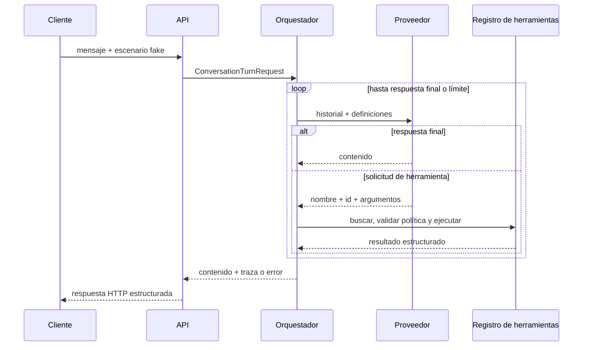
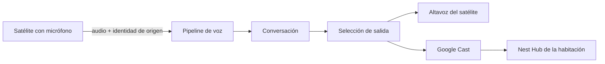

# Arquitectura

## Alcance implementado

La primera versión es un núcleo modular desplegado junto a una API. Solo se separan
ensamblados con responsabilidades ejecutables y comprobables:

- `LocalAssistant.Core`: contratos de conversación, proveedores, herramientas,
  almacenamiento en memoria y orquestación.
- `LocalAssistant.Api`: composición, configuración, escenarios demostrativos y endpoint.
- `LocalAssistant.Tests`: pruebas unitarias e integración HTTP en proceso.

No hay worker ni microservicios. Ollama, voz, Home Assistant, MQTT, bases
vectoriales y Open WebUI siguen siendo posibles procesos externos futuros.

## Flujo de una conversación

El modelo nunca ejecuta código. Devuelve una solicitud estructurada y el
orquestador solo puede resolverla contra `IToolRegistry`.

## Contratos principales

- `ILanguageProvider` recibe mensajes y definiciones de herramientas.
- `ITool` declara metadatos, esquema de entrada y ejecución cancelable.
- `IToolRegistry` constituye la allowlist de capacidades disponibles.
- `IConversationStore` aísla el orquestador del almacenamiento actual.
- `IConversationOrchestrator` ejecuta el protocolo y produce la traza.

El fake usa una cola de funciones de respuesta. Cada llamada consume exactamente
un paso, por lo que una prueba declara de forma visible la secuencia esperada.

## Topología futura de habitaciones

La evolución de voz distinguirá cuatro conceptos que hoy no necesitan tipos de
dominio propios:

- **Dispositivo de entrada:** captura audio, puede detectar localmente el wake word
  y origina un turno.
- **Dispositivo de salida:** puede reproducir audio, mostrar información o ambas
  cosas.
- **Habitación:** contexto lógico que permite asociar entradas y salidas sin
  convertirlas en un único dispositivo.
- **Conversación:** continuidad lógica de mensajes y turnos; puede comenzar en una
  habitación y, en una fase posterior, transferirse explícitamente a otra.

Entrada y salida son capacidades independientes. Un satélite puede incluir ambas,
pero también puede usar como salida un Nest Hub de su habitación. El Nest Hub no
se modelará como micrófono controlable: no se asume acceso a su audio, instalación
de wake word ni sustitución de Google Assistant.

El futuro registro de dispositivos describirá capacidades observables como captura
o reproducción de audio, pantalla, botones, indicadores y detección local de wake
word. La selección de hardware —Home Assistant Assist, ESP32-S3, Raspberry Pi,
Android u ordenador— queda abierta hasta construir un vertical slice medible.

### Revisión de los contratos actuales

`ConversationTurnRequest` ya contiene `ConversationId`, suficiente para la
identidad lógica actual, y un mensaje de texto que no presupone una interfaz web.
La API HTTP es un canal de entrada, no una propiedad permanente de la conversación.

No se añaden todavía `SourceDeviceId`, `RoomId`, canal de entrada ni capacidades de
respuesta: ningún componente actual puede validarlos, persistirlos o usarlos para
enrutar una salida. El pipeline de voz en un único dispositivo será el primer
incremento que justifique introducir un contexto opcional de origen. El primer
satélite añadirá después asociación de habitación y selección de salida con
comportamiento y tests reales.

## Conversaciones y concurrencia

`InMemoryConversationStore` conserva mensajes en un diccionario concurrente y
copia cada historial bajo bloqueo. No existe transacción que serialice dos turnos
simultáneos de la misma conversación. Esta limitación es aceptable para el entorno
de aprendizaje, pero deberá resolverse al introducir persistencia.

## Errores y timeouts

El resultado del núcleo diferencia errores como `provider_timeout`,
`tool_not_found`, `invalid_tool_arguments`, `tool_confirmation_required`,
`tool_execution_failed` e `iteration_limit_reached`. La API los traduce a códigos
HTTP sin exponer excepciones internas.

Los tokens de cancelación se propagan a proveedor, almacenamiento y herramientas.
Proveedor y herramientas reciben además un token con timeout configurable.

## Evaluación de Microsoft.Extensions.AI

`Microsoft.Extensions.AI` aporta `IChatClient`, contenido multimodal, funciones,
adaptadores, telemetría, caché y un pipeline común. También puede ejecutar de forma
automática el bucle de funciones mediante `FunctionInvokingChatClient`.

No se adopta todavía porque el propósito de esta iteración es hacer visible ese
bucle, sus fallos y sus políticas. Un adaptador futuro podrá traducir entre
`ILanguageProvider` y `IChatClient`; los contratos del dominio no necesitan cambiar.

## Observabilidad

Los eventos estructurados registran inicio y final del turno, proveedor e
iteración, solicitud y resultado de herramientas, código de error y duración. No
registran mensaje, argumentos ni contenido devuelto. OpenTelemetry se pospone hasta
que exista un consumidor concreto de trazas o métricas.

## Configuración

`LocalAssistant:Orchestration` contiene el máximo de iteraciones y los timeouts. No se
guardan secretos ni configuraciones personales en el repositorio.
