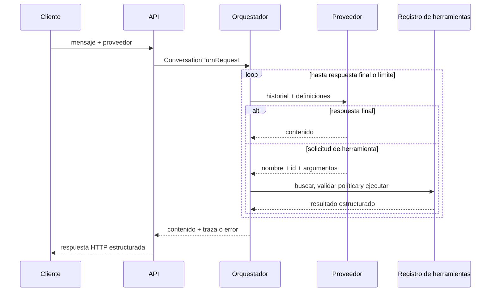
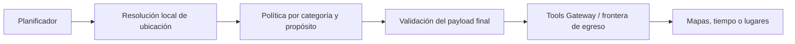
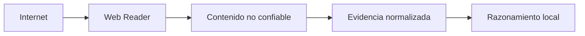
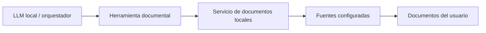
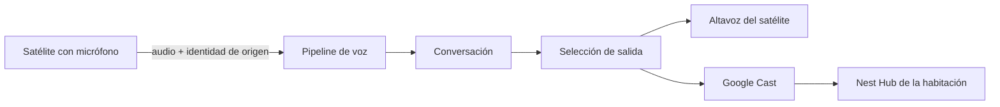

# Arquitectura

## Alcance implementado

La primera versión es un núcleo modular desplegado junto a una API. Solo se separan
ensamblados con responsabilidades ejecutables y comprobables:

- `LocalAssistant.Core`: contratos de conversación, proveedores, herramientas,
  almacenamiento en memoria y orquestación.
- `LocalAssistant.Api`: composición, configuración, escenarios demostrativos y endpoint.
- `LocalAssistant.Infrastructure`: adaptadores de sistemas externos; actualmente,
  el cliente HTTP de Ollama.
- `LocalAssistant.Tests`: pruebas unitarias e integración HTTP en proceso.

No hay worker ni microservicios. Ollama sigue siendo un proceso externo opcional;
voz, Home Assistant, MQTT, bases vectoriales y Open WebUI son evoluciones futuras.

## Flujo de una conversación

El modelo nunca ejecuta código. Devuelve una solicitud estructurada y el
orquestador solo puede resolverla contra `IToolRegistry`.

## Contratos principales

- `ILanguageProvider` recibe mensajes y definiciones de herramientas.
- `ITool` declara metadatos, esquema de entrada y ejecución cancelable.
- `IToolRegistry` constituye la allowlist de capacidades disponibles.
- `IConversationStore` aísla el orquestador del almacenamiento actual.
- `IConversationOrchestrator` ejecuta el protocolo y produce la traza.

El impacto actual de una herramienta y su indicador de confirmación son un primer
límite implementado, no un modelo completo de autorización. Una lectura puede
exponer presencia, calendario, correo, ubicación, cámaras, memoria o documentos. La
política futura evaluará conjuntamente operación, sensibilidad, principal, alcance,
egreso, confirmación, coste y otros efectos relevantes, incorporando dimensiones
solo cuando un vertical slice las necesite.

El fake usa una cola de funciones de respuesta. Cada llamada consume exactamente
un paso, por lo que una prueba declara de forma visible la secuencia esperada.

Una suite abstracta de contratos se ejecuta contra `ScriptedLanguageProvider` y
`OllamaLanguageProvider`. Verifica que cada implementación expone un nombre estable,
distingue respuesta final de solicitud de herramienta, conserva nombre y argumentos
estructurados y respeta una cancelación previa. Las pruebas específicas de cada
adaptador siguen cubriendo serialización y errores propios; la suite común no intenta
ocultar esas diferencias.

## Adaptador de Ollama

`OllamaLanguageProvider` implementa `ILanguageProvider` mediante la API HTTP nativa
de Ollama, sin introducir sus DTOs en `LocalAssistant.Core`. Traduce el historial,
los esquemas de herramientas, las solicitudes de función y sus resultados. Para
mantener un primer vertical slice pequeño y predecible, solicita `stream: false`.
El modo de razonamiento se transmite mediante `think` y queda desactivado por
defecto para reducir latencia; no se altera el texto del usuario para controlarlo.
La ventana se transmite como `options.num_ctx`, con 4096 tokens por defecto.

La API selecciona `fake` u `ollama` por turno. Ollama requiere un modelo configurado;
si falta, la petición se rechaza como error de validación antes de entrar en el
orquestador. Los tests del adaptador sustituyen la red por un manejador HTTP
determinista. Un smoke test real con `qwen3:1.7b` verificó tanto respuesta directa
como tool calling; sus tiempos dependen del modelo y del hardware.

Antes de seleccionar Ollama, `OllamaModelInspector` consulta `POST /api/show` y
requiere la capacidad `tools`. Una caché compartida por proceso evita repetir el
preflight para una combinación de endpoint y modelo ya validada. Solo se cachean
éxitos: modelo ausente, capacidad insuficiente, endpoint inválido o fallo HTTP se
devuelven como errores claros de configuración y pueden corregirse sin reiniciar.
La inspección ocurre antes de crear el turno, por lo que esos fallos no modifican el
historial de conversación. Cuando los metadatos contienen `*.context_length`, el
inspector rechaza una ventana configurada por encima del máximo del modelo.

## Dirección futura: privacidad y frontera de egreso

Esta sección describe una intención arquitectónica, no componentes implementados.
El modelo local podrá usar contexto privado para decidir qué hacer, pero ese contexto
no se convertirá implícitamente en una solicitud externa. La única excepción
inicial explícita será la ubicación cuando resulte necesaria para cumplir la
petición y su política de categoría la autorice.

La política de privacidad será anterior al routing de proveedor y constituirá una
restricción dura. Capacidad, dificultad, latencia, coste o falta de recursos locales
no permitirán enviar categorías `DENY` a un LLM externo. El router solo comparará
proveedores que puedan recibir el payload ya autorizado. Cuando una petición dependa
de contexto protegido que el modelo local no pueda procesar, podrá continuar con
capacidad reducida, usar únicamente una parte pública o saneada si sigue siendo útil,
o comunicar la limitación; la experiencia concreta queda pospuesta.

La política futura clasificará datos y payloads derivados mediante categorías
extensibles. Una primera referencia de comportamiento es:

| Categoría | Política inicial |
| --- | --- |
| `SOURCE_CODE`, `REPOSITORY_DATA` | `DENY` |
| `LOCAL_FILES`, `LOCAL_DOCUMENTS`, `RAG_CONTENT` | `DENY` |
| `MEMORY`, `CONVERSATIONS`, `DATABASE_DATA` | `DENY` |
| `SECRETS`, `CREDENTIALS`, `ENVIRONMENT`, `PRIVATE_CONFIG` | `DENY` |
| `LOCATION` | `ALLOW_WHEN_REQUIRED` |
| `SEARCH_QUERY` | `ALLOW_SANITIZED` |
| `PUBLIC_DATA` | `ALLOW` |

La lista no será un enum cerrado ni una autorización global. Una categoría nueva o
desconocida se denegará hasta disponer de política. La decisión deberá considerar
categoría, propósito, destino, proveedor, operación y procedencia. Autorizar un
campo `LOCATION` no autorizará otros campos del mismo turno.

La validación se realizará sobre el payload final. Una transformación local no
cambia automáticamente la categoría: nombres de clases, repositorios, hosts, URLs,
resúmenes o consultas derivados de información protegida seguirán protegidos. Así
se evita que un dato denegado salga indirectamente convertido en una búsqueda.

### Resolución local de ubicación

Una abstracción futura `LocationProvider` resolverá referencias antes de llamar a
servicios externos:

- `HomeLocation`: referencia configurada y conservada localmente para «en casa».
- `MobileCurrentLocation`: posición aportada por un cliente identificado cuando el
  usuario haya concedido permiso y la lectura sea suficientemente reciente.
- `ExplicitLocation`: lugar escrito o pronunciado en la petición actual.

La ubicación explícita será suficiente siempre que pueda resolver la operación, sin
consultar hogar, móvil, perfil ni memoria. Para routing, lugares cercanos o tiempo
meteorológico se enviará la precisión mínima aceptada por el servicio: texto,
ubicación aproximada, dirección o coordenadas solo según necesidad.

El ejemplo «¿cuánto se tarda de casa al aeropuerto?» podrá enviar únicamente origen
y destino al proveedor de routing. No enviará historial, memoria, documentos,
familia, perfil, código ni ningún otro contexto usado durante el razonamiento local.

### Cobertura de toda comunicación saliente

La frontera no se limitará a herramientas de Internet. LLM cloud, STT, TTS,
embeddings, telemetría, analítica, crash reporting, actualizaciones y SDKs de
terceros deberán declarar y validar sus payloads con la misma política. Siempre que
sea técnicamente práctico, los componentes internos carecerán de salida directa y
la topología obligará a atravesar un proxy o límite equivalente controlado. El
mecanismo de red concreto queda pospuesto hasta elegir despliegue.

### Frontera de entrada no confiable

El contenido recuperado de Internet será evidencia, no instrucciones. Un lector
web extraerá datos bajo límites de red y tamaño y los entregará a una zona lógica de
contenido no confiable. Esa zona no podrá conceder permisos, solicitar secretos,
leer memoria o archivos, alterar políticas ni activar herramientas por sí misma.

Las pruebas futuras cubrirán tanto la decisión lógica como la imposibilidad técnica
de saltarse estas fronteras. La auditoría conservará destino, categorías, propósito
y resultado, pero no copiará automáticamente el payload ni el contenido recuperado.

## Dirección futura: búsqueda de documentos locales

Una abstracción futura `LocalDocumentSource` localizará documentos exclusivamente
dentro de fuentes configuradas y permitidas. La primera fuente será la carpeta
Documentos real del usuario,
resuelta mediante el sistema operativo; no se fijará un nombre de usuario ni una
ruta absoluta. Añadir otra carpeta requerirá configuración explícita. Discos
completos, perfil entero, `AppData`, directorios del sistema y repositorios no serán
fuentes implícitas.

El LLM no recibirá una herramienta genérica de archivos ni producirá comandos. El
orquestador expondrá operaciones estructuradas de descubrimiento y lectura a través
de una herramienta local, mientras un servicio documental impondrá las raíces
permitidas independientemente de los argumentos del modelo.

Descubrir y leer serán capacidades diferentes. El primer vertical slice recorrerá
directamente la fuente permitida y buscará nombre, extensión, ruta relativa, fechas
y metadatos básicos sin índice persistente. Una búsqueda podrá devolver referencias
controladas por el servicio sin abrir el contenido completo. Leer requerirá una
selección explícita y validará de nuevo que el destino resuelto sigue dentro de una
raíz permitida.

La extracción textual llegará después para formatos comunes seleccionados. `.txt`,
`.md`, `.pdf` y `.docx` son candidatos, no una lista comprometida. Tipo, tamaño y
recursos estarán acotados y un formato no soportado fallará explícitamente; no se
eligen todavía formatos definitivos ni librerías. El texto extraído será dato no
confiable: podrá aportar evidencia, pero no cambiar instrucciones, permisos o
políticas ni solicitar herramientas por sí mismo.

Descubrimiento, lectura, búsqueda en contenido e ingesta RAG son etapas distintas.
Abrir un documento no lo indexará ni lo conservará como conocimiento permanente.
Un índice local, embeddings locales y recuperación semántica solo se introducirán
tras medir corpus, rendimiento y calidad. No se presupone base vectorial, watcher,
OCR ni worker. Los repositorios y símbolos de código quedan fuera de esta capacidad
y podrán requerir en el futuro una fuente separada.

`LOCAL_DOCUMENTS`, `LOCAL_FILES` y `RAG_CONTENT` seguirán en `DENY` para egreso
automático. Nombres, rutas, texto extraído e índices o embeddings tampoco se enviarán
a proveedores externos por defecto. Si una petición combina documentos e Internet,
todo dato derivado deberá superar la política sobre el payload final ya definida.
Cuando existan varios principales, fuente, búsqueda, lectura e ingesta respetarán
propiedad y alcance de acceso antes de revelar metadatos o contenido.

## Topología futura de habitaciones

La evolución de voz distinguirá cinco conceptos que hoy no necesitan tipos de
dominio propios:

- **Dispositivo de entrada:** captura audio, puede detectar localmente el wake word
  y origina un turno.
- **Dispositivo de salida:** puede reproducir audio, mostrar información o ambas
  cosas.
- **Habitación:** contexto lógico que permite asociar entradas y salidas sin
  convertirlas en un único dispositivo.
- **Conversación:** continuidad lógica de mensajes y turnos; puede comenzar en una
  habitación y, en una fase posterior, transferirse explícitamente a otra.
- **Usuario o principal:** sujeto propietario o autorizado para acceder a recursos
  personales; es independiente del canal, aparato, habitación y conversación.

Entrada y salida son capacidades independientes. Un satélite puede incluir ambas,
pero también puede usar como salida un Nest Hub de su habitación. El Nest Hub no
se modelará como micrófono controlable: no se asume acceso a su audio, instalación
de wake word ni sustitución de Google Assistant.

El futuro registro de dispositivos describirá capacidades observables como captura
o reproducción de audio, pantalla, botones, indicadores y detección local de wake
word. La selección de hardware —Home Assistant Assist, ESP32-S3, Raspberry Pi,
Android u ordenador— queda abierta hasta construir un vertical slice medible.

`ConversationId`, `User` o `Principal`, `DeviceId` y `RoomId` representan
identidades diferentes. Varias personas pueden compartir un dispositivo o una
habitación, una persona puede mantener varias conversaciones y una conversación
puede cambiar de habitación. Autenticar un satélite prueba la identidad del
dispositivo, no la del usuario. Memoria personal, calendario y otros recursos
privados requerirán propiedad y alcance de acceso explícitos antes de persistirse o
exponerse. No se eligen ahora biometría de voz, identificación automática de
hablante ni un sistema completo de autenticación.

### Revisión de los contratos actuales

`ConversationTurnRequest` ya contiene `ConversationId`, suficiente para la
continuidad lógica actual, y un mensaje de texto que no presupone una interfaz web.
Ese identificador no representa a un usuario ni concede acceso a recursos
personales. La API HTTP es un canal de entrada, no una propiedad permanente de la
conversación.

No se añaden todavía `SourceDeviceId`, `RoomId`, canal de entrada ni capacidades de
respuesta: ningún componente actual puede validarlos, persistirlos o usarlos para
enrutar una salida. El pipeline de voz en un único dispositivo será el primer
incremento que justifique introducir un contexto opcional de origen. El primer
satélite añadirá después asociación de habitación y selección de salida con
comportamiento y tests reales.

## Conversaciones y concurrencia

`InMemoryConversationStore` conserva mensajes en un diccionario concurrente y
copia cada historial bajo bloqueo. No existe transacción que serialice dos turnos
simultáneos de la misma conversación. Esta limitación es aceptable para el entorno
de aprendizaje, pero deberá resolverse al introducir persistencia.

Antes de persistir información privada se definirán propiedad y alcance de acceso,
retención, borrado selectivo, control de acceso, protección en reposo, auditoría y
consecuencias de backup y restauración. El mecanismo concreto dependerá del
almacenamiento y despliegue elegidos; no se presupone cifrado de aplicación, base de
datos concreta ni que el cifrado de disco resulte suficiente por sí solo.

## Errores y timeouts

El resultado del núcleo diferencia errores como `provider_timeout`,
`tool_not_found`, `invalid_tool_arguments`, `tool_confirmation_required`,
`tool_execution_failed` e `iteration_limit_reached`. La API los traduce a códigos
HTTP sin exponer excepciones internas.

Los tokens de cancelación se propagan a proveedor, almacenamiento y herramientas.
Proveedor y herramientas reciben además un token con timeout configurable.
En Ollama, cancelar durante `SendAsync` interrumpe la espera HTTP y se ha comprobado
con un handler bloqueado que observa el token. El servidor puede necesitar tiempo
para detener trabajo interno; la cancelación sigue siendo cooperativa.

## Evaluación de Microsoft.Extensions.AI

`Microsoft.Extensions.AI` aporta `IChatClient`, contenido multimodal, funciones,
adaptadores, telemetría, caché y un pipeline común. También puede ejecutar de forma
automática el bucle de funciones mediante `FunctionInvokingChatClient`.

No se adopta todavía porque el propósito de esta iteración es hacer visible ese
bucle, sus fallos y sus políticas. Un adaptador futuro podrá traducir entre
`ILanguageProvider` y `IChatClient`; los contratos del dominio no necesitan cambiar.

## Observabilidad

Los eventos estructurados registran inicio y final del turno, proveedor e
iteración, solicitud y resultado de herramientas, código de error y duración. No
registran mensaje, argumentos ni contenido devuelto. OpenTelemetry se pospone hasta
que exista un consumidor concreto de trazas o métricas.

## Configuración

`LocalAssistant:Orchestration` contiene el máximo de iteraciones y los timeouts.
`LocalAssistant:Ollama` contiene `Endpoint`, `Model`, `Think` y `ContextWindow`; el
repositorio deja el modelo vacío para que Ollama permanezca desactivado por defecto.
El timeout de proveedor es global y vale tres minutos para tolerar inferencia local
en CPU. No se guardan secretos ni configuraciones personales en el repositorio.
